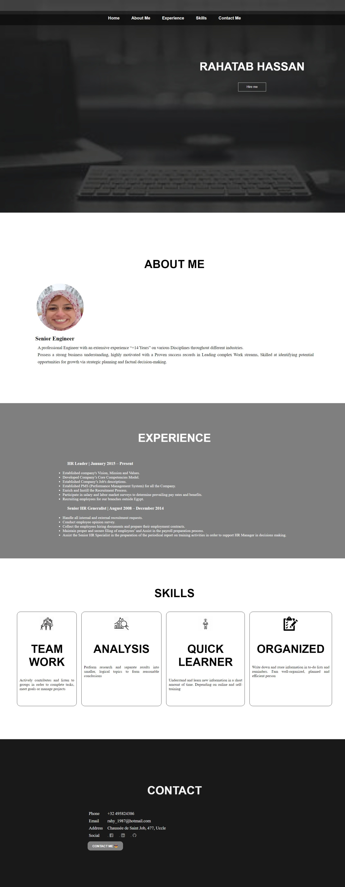

# Portfoilio

Collection of your work or achievements that show your skills, experience, and
abilities in a particular field. It is commonly used by professionals, artists,
designers, writers, and individuals in creative industries to demonstrate their
talent and expertise. A portfolio can be presented in various formats, including
physical documents, digital files, websites, or online platforms.

## Table of contents

- [Portfoilio](#portfoilio)
  - [Table of contents](#table-of-contents)
  - [General info](#general-info)
  - [Screenshots](#screenshots)
  - [Technologies](#technologies)
  - [Setup](#setup)
  - [Status](#status)
  - [Contact](#contact)

## General info

> Portfolio should be a dynamic and evolving representation of your skills and
> capabilities. Continuously refine and improve it as you progress in your
> career or develop new talents.

## Screenshots

## Technologies

- HTML
- CSS
- VSC code
- JavaScript

## Setup

- Clone the repo.
- `npm run start`

## Status

Project is: _Done_

## Contact

By [Rahatab Hassan]
