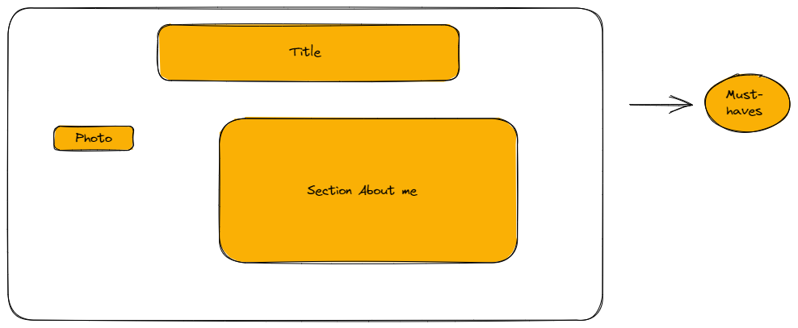

# Design

## Project's design overview

> Portfolio to show skills, experience, and abilities in a particular field. it
> is commonly used by professionals, artists,designers, writers, and individuals
> in creative industries to demonstrate their talent and expertise. A portfolio
> can be presented in various formats, including physical documents, digital
> files, websites, or online platforms.

## Wireframe(s)

### Home Page

> 

### About

> 

### Experience

> 

### Skills

> 

### Contact

